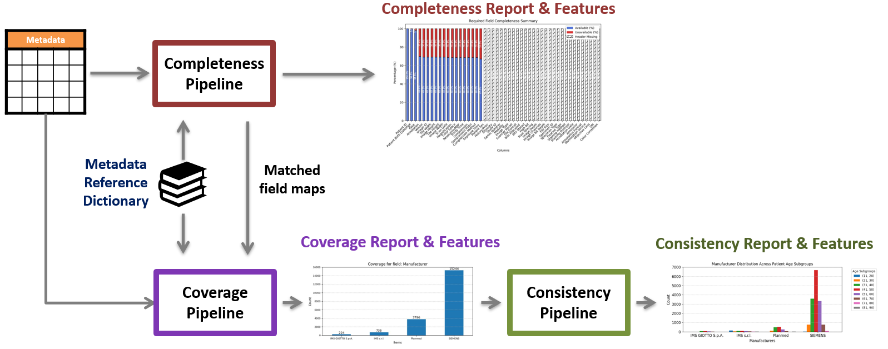
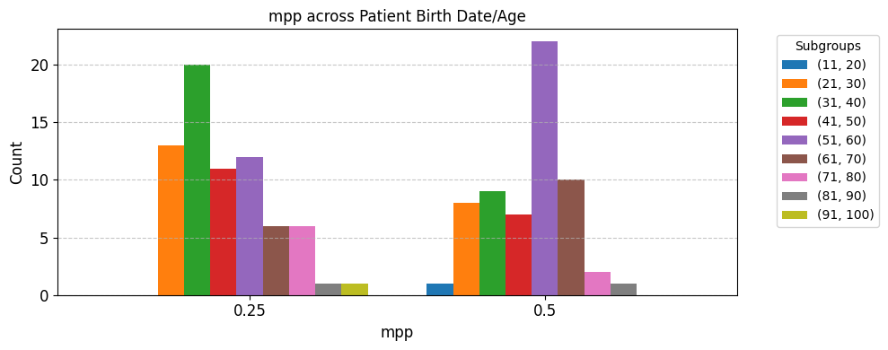

# Datacard - Metadata Consistency Assessment

This directory contains code for the assessment of metadata Consistency for the DataCard project.

> [!NOTE]
> **This code is work-in-progress.**

## Overview

This tool is intended to work jointly with the Coverage Completeness assessment pipeline to assess Consistency for a target field against a subgroup field in a metadata file. 

First, the matched field map for a metadata file is generated using the completeness assessment pipeline, after which an assessment
is performed on the subgroup distribution of values for the target field. 
An outline of this pipeline is given below.



The current iteration of the code takes a metadata csv file and a json metadata reference dictionary as input.
A list of matched data header fields are returned as terminal output.
A visualization of the counts of different values for the target field per subgroup is also produced and saved in the `/output` directory.


## Directory organization

`compute_consistency.py` - Functions for computing consistency for a target field


## Usage

The tool can be used by running the `dcard_consistency_main.py` python module.

The module accepts 3 arguments:

`--data_path`: Path to dataset metadata file on which coverage assessment needs to be performed

`--reference_path`:  Path to metadata reference dictionary

`--cc_level`: The level at which completeness should be assessed. This argument is used to specify a subgroup within the chosen metadata dictionary.


### Inputs


Perform consistency check of coverage for a specified "target" field against a specified "subgroup" field.

Two coverage parameter dictionaries need to be specified, one of each field. 

The coverage_params dictionary consists of the required parameters for the coverage check:
    
   - target_field : The metadata field for which coverage will be computed
   - field_values : All possible values for the target field. If set to None, field_values will be generated from the unique values of the target_field in the metadata.
   - dtype (Optional): 'str' for string or 'int' for integer type. Needed along with regex to extract data values from metadata field item strings
   - value_buckets (Optional): A list of numeric values which the target field values will be bucketed into depending on distance.
   - metric: 'KLD' for Kullback–Leibler divergence or 'HD' for Hellinger distance
   - fill_na (Optional): Fill NA values in target field with a specific value. Set to 'None' to drop all NA values
   - thresholds (Optional): For numeric variables, only compute coverage within a specified range of values. Eg: [10, 80]
   - bin_count (Optional): For numeric variables, number of bins to generate a histogram plot

```python
   coverage_params_subgroup = {
        'target_field': "Patient Birth Date/Age",
        'field_values': None,
        'dtype': 'int',
        'metric': 'HD',
        'fill_na': None,
        'thresholds': [11, 100],
        'bin_count': 10,
    }

    coverage_params_target = {
        'target_field': "mpp",
        'field_values': None,
        'dtype': 'str',
        'value_buckets': [0.25, 0.5],
        'metric': 'HD',
        'fill_na': None,
        'thresholds': None,
        'bin_count': None,
    }
```

### Output

The main outputs of dcard-consistency are consistency features returned by the function `consistency_check`.


#### Figure outputs

The following figure visualizing the consistency information is also produced and saved in the `/output` directory.

**Consistency Summary**: A barchart with grouped bars corresponding to  available values for the target field. The count for each field is also shown. The output shown here is for 'Magnification Per Pixel' for different 'Age' subgroups on the WashU metadata file.


