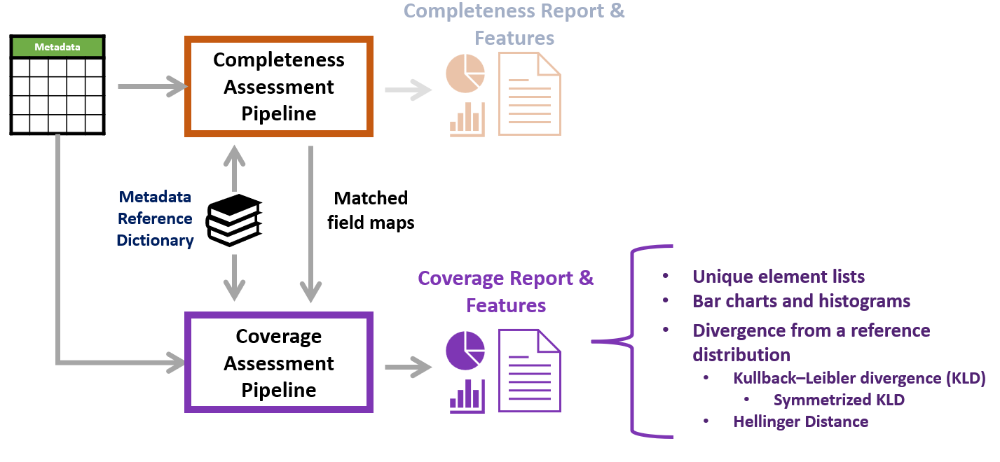
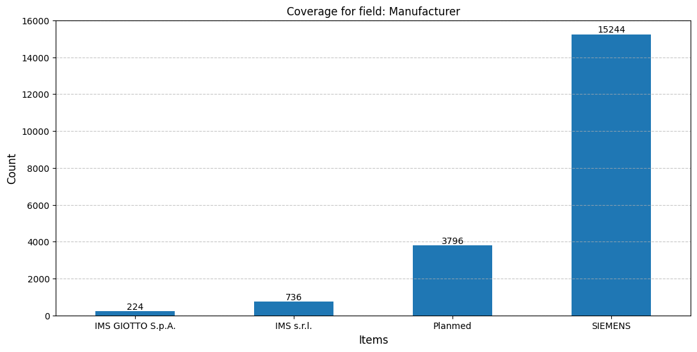

# Datacard - Metadata Coverage Assessment

This directory contains code for the assessment of metadata Coverage for the DataCard project.

> [!NOTE]
> **This code is work-in-progress.**

## Overview

This tool is intended to work jointly with the Completeness assessment pipeline to assess Coverage for a target field in a metadata file. 

First, the matched field map for a metadata file is generated using the completeness assessment pipeline, after which an assessment
is performed on the distribution of values for the target field. 
An outline of this pipeline is given below.



The current iteration of the code takes a metadata csv file and a json metadata reference dictionary as input.
By default, divergence calculation is performed against a uniform distribution of possible values of the target field.
A second metadata file can optionally be provided in which case divergence is calculated using the same field in the second metadata file as reference.
A list of matched data header fields are returned as terminal output, and coverage information is provided for the selected field in the form of
a list of unique values and the value of the divergence measure from the reference distribution.
A visualization of the counts of different values for the target field is also produced and saved in the `/output` directory.


## Installation

Please follow installation process for dcard-completeness.


## Directory organization

`dcard_coverage_main.py` - Main python module

`compute_coverage.py` - Functions for computing coverage for a target field

## Usage

The tool can be used by running the `dcard_coverage_main.py` python module.

The module accepts 3 arguments:

`--data_path`: Path to dataset metadata file on which coverage assessment needs to be performed

`--reference_data_path` (Optional) : Path to a second metadata file that also contains the target field. If not provided, coverage will be computed against a uniform distribution of target field values.

`--reference_path`:  Path to metadata reference dictionary

`--cc_level`: The level at which completeness should be assessed. This argument is used to specify a subgroup within the chosen metadata dictionary.


### Inputs

The coverage assessment script requires the same inputs as the completeness assessment, along with an optional second metadata file to compare the target field coverage to the same field in a second dataset.

The coverage_params dictionary consists of the required parameters for the coverage check:
    
   - target_field : The metadata field for which coverage will be computed
   - field_values : All possible values for the target field. If set to None, field_values will be generated from the unique values of the target_field in the metadata.
   - dtype (Optional): 'str' for string or 'int' for integer type. Needed along with regex to extract data values from metadata field item strings
   - metric: 'KLD' for Kullback–Leibler divergence or 'HD' for Hellinger distance
   - fill_na (Optional): Fill NA values in target field with a specific value. Set to 'None' to drop all NA values
   - thresholds (Optional): For numeric variables, only compute coverage within a specified range of values. Eg: [10, 80]
   - bin_count (Optional): For numeric variables, number of bins to generate a histogram plot

```python
coverage_params = {
        'target_field': "Manufacturer",    
        'field_values': None,
        'dtype': 'str',
        'metric': 'HD',
        'fill_na': None,
        'thresholds': None,
        'bin_count': None,
    }
```

### Output

The main outputs of dcard-coverage are coverage features returned by the function `coverage_check`.

The main script also outputs basic coverage statistics along with the divergence measure in the terminal window and a coverage plot which is saved in the `/output` directory.

Given below is the terminal output for `Manufacturer` coverage assessment for the VinDr-Mammo `metadata.csv` file using the `dm_metadata_dictionary.json` dictionary and performing assessment for the **Core Fields**.

```
Assessing completeness for metadata file 'metadata.csv'
Required Header         Matched Dataset Header
---------------------------------------------
Patient Birth Date/Age  Patient's Age
Breast Orientation      View Position
Laterality              Image Laterality
Image Dimension         Rows        
Pixel Spacing           Imager Pixel Spacing
Manufacturer            Manufacturer
Manufacturer/Model      Manufacturer's Model Name

Coverage Information: Manufacturer
Number of records (after cleaning and thresholding): 20000
Unique values of Manufacturer: ['IMS GIOTTO S.p.A.' 'IMS s.r.l.' 'Planmed' 'SIEMENS']
Divergence metric: Hellinger distance
Divergence from uniform: 0.4436415247586628
```
#### Figure outputs

The following figure visualizing the coverage information is also produced:

**Coverage Summary**: A barchart with bars corresponding to expected values or available values for the target field. The count for each field is also shown. The output shown here is for 'Manufacturer' coverage 'Core Fields' assessment on the VinDr-Mammo metadata file.


