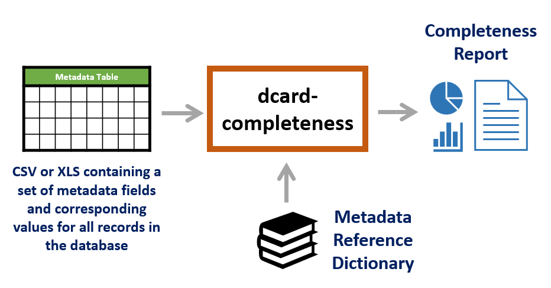
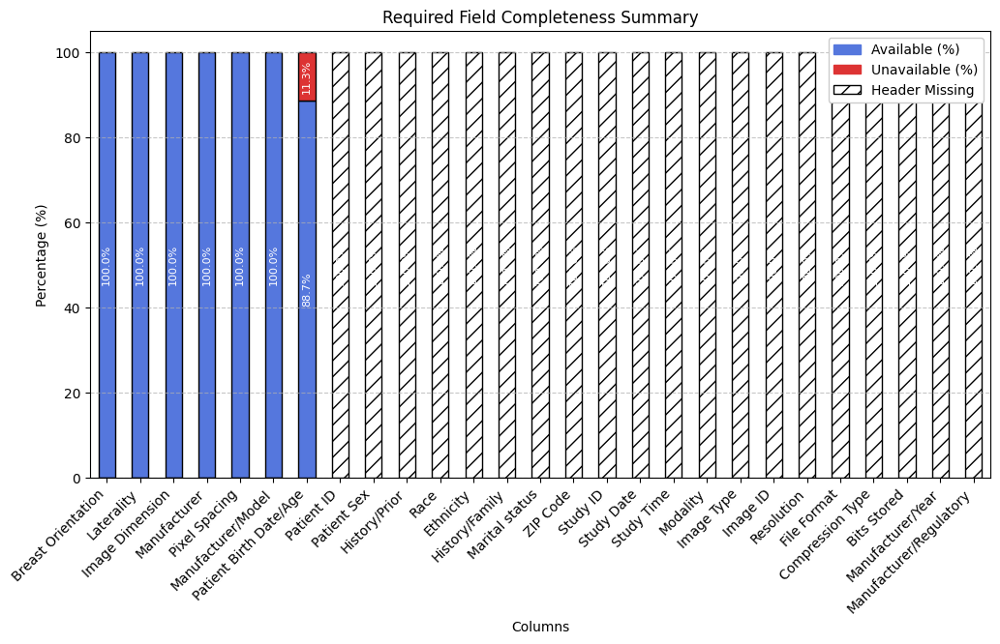
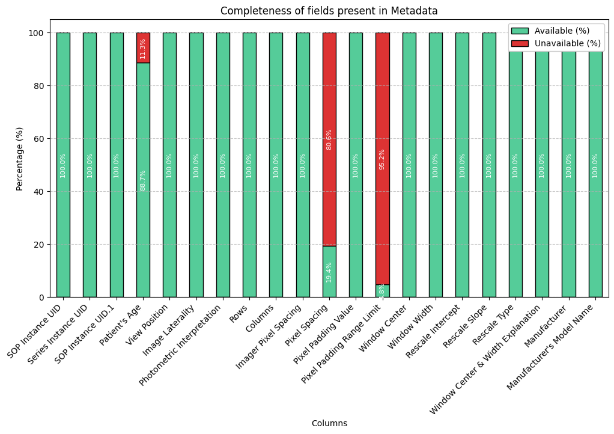

# Datacard - Metadata Completeness Assessment

This repository contains code for the assessment of metadata Completeness for the DataCard project.

 [!NOTE]
**This code is work-in-progress.**

## Overview

This tool is intended to take a metadata table for a medical imaging dataset and generate a report indicating the
level of Completeness of the metadata. To do so, a modality specific metadata reference dictionary containing required
field information is used along with the metadata file. An outline of this pipeline is given below.



The current itertion of the code takes a metadata csv file and a json metadata reference dictionary as input.
A list of matched, missing, and unexpected data header fields are returned as terminal output.
Visulaizations for field and record completeness can also be produced and saved in the `/output` directory.
The file inputs are currently hard-coded.


## Installation

The code uses python programming language. A python virtual environment can be created
to install the packages required to run this code. A python venv named `dcard` can be
created using

```
   python3 -m venv .dcard
```

The environment can be actiavted using
```
   source .dcard/bin/activate
```
After activation, the required packages can be installed inside the environment by running

```
   python3 -m pip install -r requirements.txt
```


## Repository organization

`dcard_completeness_main.py` - Main python module

`io_utils.py` - Functions for reading files and producing plots

`score_utils.py` - Functions for calculating completeness metrics

`field_matching_utils.py` - Functions for matching dataset field names with required field names

## Usage

The tool can be used by running the `dcard_completeness_main.py` python module.

The module accepts 3 arguments:

`--data_path`: Path to dataset metadata file on which completeness assessment needs to be performed

`--reference_path`:  Path to metadata reference dictionary

`--cc_level`: The level at which completeness should be assessed. This argument is used to specify a subgroup within the chosen metadata dictionary.

Metadata dictionaries follow the general structure shown below:

## Example Digital Mammography dictionary exerpt:

$\color{black}{\mathbf{- General Fields:}} \space \color{gray}{\text{\\# A top level grouping of field classes, referred to as a field Category.}}$


$\color{black}\hspace{10pt}{\mathbf{- Core Fields:}}\space \color{gray}{\text{\\# A group of fields, referred to as a field Class. Completeness is calculated at the Class level.}}$


$\color{black}\hspace{40pt}{\textbf{- Patient ID:}} \space \color{gray}{\text{\\# A potential header in a metadata file, referred to as a Field.} \space \color{black} \\{ }$

$\color{black}\hspace{50pt}{\textbf{- description:} \space \color{darkblue}\text{Unique alphanumeric string to identify different records from the same patient within a dataset}}$

$\color{gray}\hspace{60pt}{\text{\\# Text description of the expected information for the field}}$

$\color{black}\hspace{50pt}{\textbf{- dtype:} \space \color{darkblue}\text{string}}$

$\color{gray}\hspace{60pt}{\text{\\# The expected data type for the field}}$

$\color{black}\hspace{50pt}{\textbf{- aliases:} \space \color{darkblue}\text{[Patient Identifier, Unique Patient ID, DICOM Patient ID]}}$

$\color{gray}\hspace{60pt}{\text{\\# A list of possible terms that might also be used to refer to the field}}$

$\color{black}\hspace{50pt}{\textbf{- checkCoverage:} \space \color{darkblue}\text{False}}$

$\color{gray}\hspace{60pt}{\text{\\# A flag (boolean) to indicate if coverage analysis needs to be done for the data corresponding to the field.}}$

$\color{black}\hspace{50pt}{\\}}$


$\color{black}\hspace{40pt}{\textbf{- Patient Birth Date/Age:}\space \\{ }$

$\color{black}\hspace{50pt}{\textbf{- description:} \space \color{darkblue}\text{Birth date or age of patient}}$

$\color{black}\hspace{50pt}{\textbf{- dtype:} \space \color{darkblue}\text{string}}$

$\color{black}\hspace{50pt}{\textbf{- aliases:} \space \color{darkblue}\text{['Birth Date', 'Date of Birth', 'DOB', 'Age', 'Patient Age', "Patient's Age", 'Age at dx']}}$

$\color{black}\hspace{50pt}{\textbf{- checkCoverage:} \space \color{darkblue}\text{True}}$

$\color{black}\hspace{50pt}{\\}}$


$\color{black}\hspace{40pt}{\textbf{- Image Resolution:}\space \\{ }$

$\color{black}\hspace{50pt}{\textbf{- description:} \space \color{darkblue}\text{The resolution of the image, typically in pixels-per-inch}}$

$\color{black}\hspace{50pt}{\textbf{- dtype:} \space \color{darkblue}\text{int}}$

$\color{black}\hspace{50pt}{\textbf{- aliases:} \space \color{darkblue}\text{['Resolution', 'PPI', 'Pixels per inch']}}$

$\color{black}\hspace{50pt}{\textbf{- checkCoverage:} \space \color{darkblue}\text{True}}$

$\color{black}\hspace{50pt}{\\}}$

$\color{black}\hspace{50pt}{\textbf{...}}$


$\color{black}\hspace{10pt}{\textbf{- Additional Fields:}}$

$\color{black}\hspace{40pt}{\textbf{- Photometric Interpretation:}\space \\{ }$

$\color{black}\hspace{50pt}{\textbf{- description:} \space \color{darkblue}\text{Intended interpretation of the image pixel data (Monochrome 1 or Monochrome 2)}}$

$\color{black}\hspace{50pt}{\textbf{- dtype:} \space \color{darkblue}\text{string}}$

$\color{black}\hspace{50pt}{\textbf{- aliases:} \space \color{darkblue}\text{[`']}}$

$\color{black}\hspace{50pt}{\textbf{- checkCoverage:} \space \color{darkblue}\text{False}}$

$\color{black}\hspace{50pt}{\\}}$

$\color{black}\hspace{50pt}{\textbf{...}}$


$\color{black}{\textbf{- Modality Specific Fields:}}$

$\color{black}\hspace{10pt}{\textbf{- DBT:}}$

$\color{black}\hspace{40pt}{\textbf{- Projection Views:}\space \\{ }$

$\color{black}\hspace{50pt}{\textbf{- description:} \space \color{darkblue}\text{Number of projection views used for the DBT acquisition}}$

$\color{black}\hspace{50pt}{\textbf{- dtype:} \space \color{darkblue}\text{int}}$

$\color{black}\hspace{50pt}{\textbf{- aliases:} \space \color{darkblue}\text{['Projections', 'DBT Projections', 'DICOM Patient ID']}}$

$\color{black}\hspace{50pt}{\textbf{- checkCoverage:} \space \color{darkblue}\text{True}}$

$\color{black}\hspace{50pt}{\\}}$

$\color{black}\hspace{50pt}{\textbf{...}}$

$\color{black}\hspace{20pt}{\textbf{...}}$


$\color{black}{\textbf{- Task Specific Fields:}}$

$\color{black}\hspace{10pt}{\textbf{- Density Estimation:}}$

$\color{black}\hspace{40pt}{\textbf{- Breast Density:}\space \\{ }$

$\color{black}\hspace{50pt}{\textbf{- description:} \space \color{darkblue}\text{Breast density expressed as a numeric value or ACR category}}$

$\color{black}\hspace{50pt}{\textbf{- dtype:} \space \color{darkblue}\text{string}}$

$\color{black}\hspace{50pt}{\textbf{- aliases:} \space \color{darkblue}\text{['Density', 'Breast Composition', 'ACR', 'ACR Value']}}$

$\color{black}\hspace{50pt}{\textbf{- checkCoverage:} \space \color{darkblue}\text{True}}$

$\color{black}\hspace{50pt}{\\}}$

$\color{black}\hspace{50pt}{\textbf{...}}$

$\color{black}\hspace{20pt}{\textbf{...}}$


-----

Chosing a subgroup using the `--cc_level` parameter will evaluate completeness with respect to all the fields nested within that subgroup. The default value for this argument is `None` which uses all the fields inside the dictionary.

Besides dictionary-based matching, there are some other additional experimental matching methods implemented in this freamwork. The methods can be used by modifying the flags in the `header_matching_methods` dictionary in `dcard_completeness_main.py`.

This dictionary consists of a set of methods that are executed in order.
The value for each method is a tuple in which the first item is a flag to enable/disable the method
and the second item contains any additional parameters needed for that method (or None).
`UA` refers to User-Assisted. Enabling this method will use either fuzzy matching or token matching using a language model
to return likely matches for header fields that could not be automatically matched.
For each such field, the user will receive a prompt to select a field from one of the top N 
most likely options (specified by 'limit').
The token matching option is disabled in this version of the code.

```python
header_matching_methods = {
        'strict':(False,None),
        'dictionary':(True,{'field_dictionary':metadata_reference_dictionary}),
        'soft': (False,None),
        'fuzzy': (False,{'threshold':80}),
        'UA':(False,{'ranking_method':'LM','limit':4})  # 'fuzzy' or 'LM'
    }
```

### Output

The output consists of text in the terminal window and a set of completeness plots which are saved in the output directory.

Given below is the output for the VinDr-Mammo `metadata.csv` file using the `dm_metadata_dictionary2.json` dictionary and performing assessment for the **Core Fields**.

```
Assessing completeness for metadata file 'metadata.csv'
Required Header         Matched Dataset Header
---------------------------------------------
Patient Birth Date/Age  Patient's Age
Breast Orientation      View Position
Laterality              Image Laterality
Image Dimension         Rows        
Pixel Spacing           Imager Pixel Spacing
Manufacturer            Manufacturer
Manufacturer/Model      Manufacturer's Model Name

Missing Headers: ['Patient ID', 'Patient Sex', 'History/Prior', 'Race', 'Ethnicity', 'History/Family', 'Marital status', 'ZIP Code', 'Study ID', 'Study Date', 'Study Time', 'Modality', 'Image Type', 'Image ID', 'Resolution', 'File Format', 'Compression Type', 'Bits Stored', 'Manufacturer/Year', 'Manufacturer/Regulatory']

Unexpected Headers: ['SOP Instance UID', 'Series Instance UID', 'SOP Instance UID.1', 'Photometric Interpretation', 'Columns', 'Pixel Spacing', 'Pixel Padding Value', 'Pixel Padding Range Limit', 'Window Center', 'Window Width', 'Rescale Intercept', 'Rescale Slope', 'Rescale Type', 'Window Center & Width Explanation']

Completeness Score: 0.26

== Record Completeness Summary ==
Total number of records: 20000
Number of complete records: 0
   Missing Values per Record  Number of Records
0                         20              17740
1                         21               2260
```


