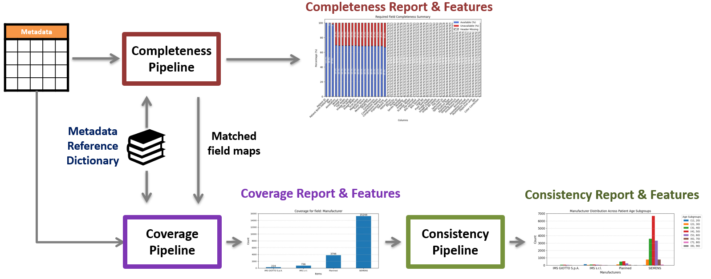
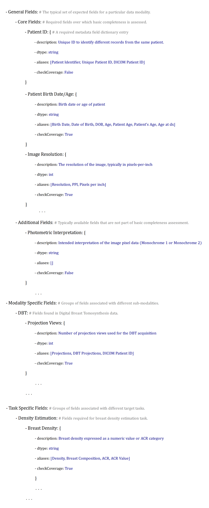

# DataCard - Metadata

This repository contains code for the assessment of Completeness, Coverage, and Consistency for the DataCard project.

> [!NOTE]
> **This code is work-in-progress.**

## Overview

This tool is intended to take a metadata table for a medical imaging dataset and generate a report indicating the
level of Completeness, Coverage, and Consistency of the metadata. To do so, a modality specific metadata reference dictionary containing required field information is used along with the metadata file. An outline of this pipeline is given below.




## Installation

The code uses python programming language. A python virtual environment can be created
to install the packages required to run this code. A python venv named `dcard` can be
created using

```
   python3 -m venv .dcard
```

The environment can be activated using
```
   source .dcard/bin/activate
```
After activation, the required packages can be installed inside the environment by running

```
   python3 -m pip install -r requirements.txt
```


## Modules

DataCard Metadata comprises several integrated modules:

1. **Completeness Assessment** ([dcard_completeness_main.py](https://github.com/DIDSR/DataCard-Metadata/blob/main/dcard_completeness_main.py))

      * Identifies available, missing, and unexpected data header fields in a metadata files and produces visualizations for field and record completeness.

2. **Coverage Assessment** ([dcard_coverage_main.py](https://github.com/DIDSR/DataCard-Metadata/blob/main/dcard_coverage_main.py))

      * Performs assessment of the distribution of values for a target field, qunatifies deviation from a reference distribution, and produces distribution visualizations. 

3. **Consistency Assessment** ([dcard_consistency_main.py](https://github.com/DIDSR/DataCard-Metadata/blob/main/dcard_consistency_main.py))

      * For a target field and a subgroup field, performs assessment of the subgroup distribution of values and produces distribution visualizations. 

4. **IPython Notebook with demo of end-to-end pipeline** ([DCard3C_demo.ipynb](https://github.com/DIDSR/DataCard-Metadata/blob/main/DCard3C_demo.ipynb))
   * **[Completeness Demo](https://github.com/DIDSR/DataCard-Metadata/blob/main/DCard3C_demo.ipynb#completeness-demo)**
   * **[Coverage Demo](https://github.com/DIDSR/DataCard-Metadata/blob/main/DCard3C_demo.ipynb#coverage-demo)**
   * **[Consistency Demo](https://github.com/DIDSR/DataCard-Metadata/blob/main/DCard3C_demo.ipynb#consistency-demo)**


## Usage

The tool can be used by running the any of the main python modules or the IPython Notebook.

The modules accept 3 arguments:

`--data_path`: Path to dataset metadata file on which assessment needs to be performed

`--reference_path`:  Path to metadata reference dictionary

`--cc_level`: The level at which assessment should be performed. This argument is used to specify a subgroup within the chosen metadata dictionary.


### Inputs

#### Metadata file

The main input to the tool is a CSV or XLS file containing a set of metadata fields and corresponding values for all records in the database.

A typical metadata file might be organized as follows:

| Patient ID  | Age | Scan Date  | Image ID | Manufacturer  | Resolution (ppi) |
| ----------- | ------ |------- | ------- | -------- | ------ | 
| ABC123  | 29  | 2015-06  | PQ30001  | Hologic  | 500  |
| ABC124  | 52  | 2018-01  | ZD23005  | Siemens  | 700  | 
| ABC124  | 52  | 2018-01  | ZD23006  | Siemens  | 700  | 


#### Metadata dictionary

A metadata dictionary is a json file with metadata fields required for completeness assessment organized in a nested dictionary structure.
Each dictionary is specific to an imaging modality. Examples for modality can be Digital Mammography or Digital Pathology.

Metadata dictionaries follow the three level structure shown below:

```markdown

**Category** (A top level grouping of field classes)
│
├─ **Class** (A group of fields. Completeness is calculated at the Class level.)
│   │
│   ├─ **Field** (A potential header in a metadata file, referred to as a Field, Eg. Patient ID, Image Resolution)
│   │   │
│   │   ├─ description (Text description of the expected information for the field)
│   │   ├─ dtype (The expected data type for the field)
│   │   ├─ aliases (list of possible terms that might also be used to refer to the field)
│   │   └─ checkCoverage (A flag (boolean) to indicate if coverage analysis needs to be done for the data corresponding to the field.)
│   └─ ...
└─ ...

```

### Example dictionary excerpt:

<details open>

<summary> Digital Mammography </summary>

----



-----

</details>

Choosing a subgroup using the `--cc_level` parameter will evaluate completeness with respect to all the fields nested within that subgroup.


### Output

The main outputs of the individual modules are data features as well as plots saved in the output directory.

#### Completeness
A list of matched, missing, and unexpected data header fields are returned as terminal output.
Visualizations for field and record completeness can also be produced and saved in the `/output` directory.

#### Coverage
A list of matched data header fields are returned as terminal output, and coverage information is provided for the selected field in the form of
a list of unique values and the value of the divergence measure from the reference distribution.
A visualization of the counts of different values for the target field is also produced and saved in the `/output` directory.

#### Consistency
A list of matched data header fields are returned as terminal output.
A visualization of the counts of different values for the target field per subgroup is also produced and saved in the `/output` directory.


## Getting started example

The **[DCard3C_demo.ipynb](https://github.com/DIDSR/DataCard-Metadata/blob/main/DCard3C_demo.ipynb)** notebook is a good starting point featuring input and output examples for all 3 modules for Whole Slide Imaging and Digital Mammography.

## Files and Data

The `/data` directory contains the metadata reference dictionaries needed for the assessment modules.

## Contact and Contributions

Seyed Kahaki: [seyed.kahaki@fda.hhs.gov](seyed.kahaki@fda.hhs.gov)

Tahsin Rahman: [tahsin.rahman@fda.hhs.gov](tahsin.rahman@fda.hhs.gov)

## Acknowledgements

This project was supported in part by an appointment to the ORISE Research Participation Program at the Center for Devices and Radiological Health, U.S. Food and Drug Administration, administered by the Oak Ridge Institute for Science and Education through an interagency agreement between the U.S. Department of Energy and FDA/CDRH.

## Disclaimer

This software and documentation (the "Software") were developed at the **US Food and Drug Administration** (FDA) by employees of the Federal Government in the course of their official duties. Pursuant to Title 17, Section 105 of the United States Code, this work is not subject to copyright protection and is in the public domain. Permission is hereby granted, free of charge, to any person obtaining a copy of the Software, to deal in the Software without restriction, including without limitation the rights to use, copy, modify, merge, publish, distribute, sublicense, or sell copies of the Software or derivatives, and to permit persons to whom the Software is furnished to do so. FDA assumes no responsibility whatsoever for use by other parties of the Software, its source code, documentation or compiled executables, and makes no guarantees, expressed or implied, about its quality, reliability, or any other characteristic. Further, use of this code in no way implies endorsement by the FDA or confers any advantage in regulatory decisions. Although this software can be redistributed and/or modified freely, we ask that any derivative works bear some notice that they are derived from it, and any modified versions bear some notice that they have been modified.
